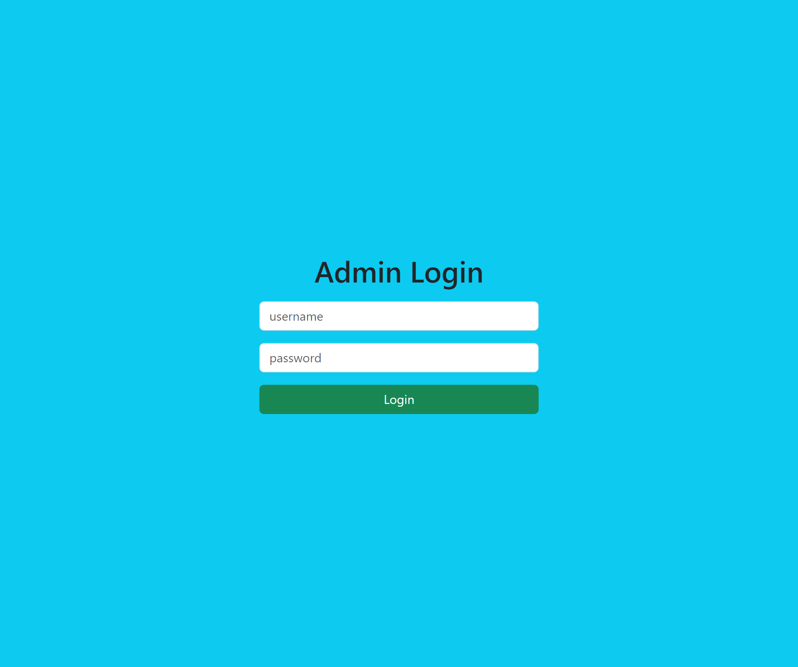

# Pizza: A pizza delivery app

Pizza is a hassle-free online platform that brings the delicious world of pizza right to your doorstep. So, you can easily browse through a variety of mouthwatering pizza options and place your order in just a few clicks.

## Table of contents

- [Pizza: A pizza delivery app](#pizza-a-pizza-delivery-app)
  - [Table of contents](#table-of-contents)
  - [Overview](#overview)
    - [Functionalities](#functionalities)
    - [Screenshot](#screenshot)
  - [My process](#my-process)
    - [Built with](#built-with)
  - [Note](#note)
  - [Author](#author)

## Overview

### Functionalities

Admin can:

- Log in using their credentials.
- Logout.
- Manage their pizza menu.
  - Add new pizzas.
  - Remove existing pizza.
- Manage customer orders.
  - Process, update, and track order statuses.

Customers can:

- Create a new account.
- Log in using their credentials.
- Logout.
- View the menu.
- Place and track order statuses.

### Screenshot

ADMIN

SIGN IN SCREEN

|  |
| :-----------------------------------------------------: |

HOME SCREEN

|  |
| :-----------------------------------------------------: |

ORDERS SCREEN

|  |
| :-----------------------------------------------------: |

CUSTOMER

SIGN UP SCREEN

|  |
| :-----------------------------------------------------: |

SING IN SCREEN

|  |
| :-----------------------------------------------------: |

HOME SCREEN

|  |  |
| :-----------------------------------------------------: | :-----------------------------------------------------: |

ORDERS SCREEN

|  |
| :-----------------------------------------------------: |

## My process

### Built with

- **Frontend:**
  - Django ([https://www.djangoproject.com/])
- **Backend:**
  - Django ([https://www.djangoproject.com/])

## Note

This project was developed as part of the *Develop a Pizza Delivery App with Django 3.1* udemy course.

## Author

- Frontend Mentor - [@wess-MHHW](https://www.frontendmentor.io/profile/wess-MHHW)
- LeetCode - [@wess-MHHW](https://leetcode.com/wess-MHHW/)
- Linkedin - [@wassim-maaoui](https://www.linkedin.com/in/wassim-maaoui/)
